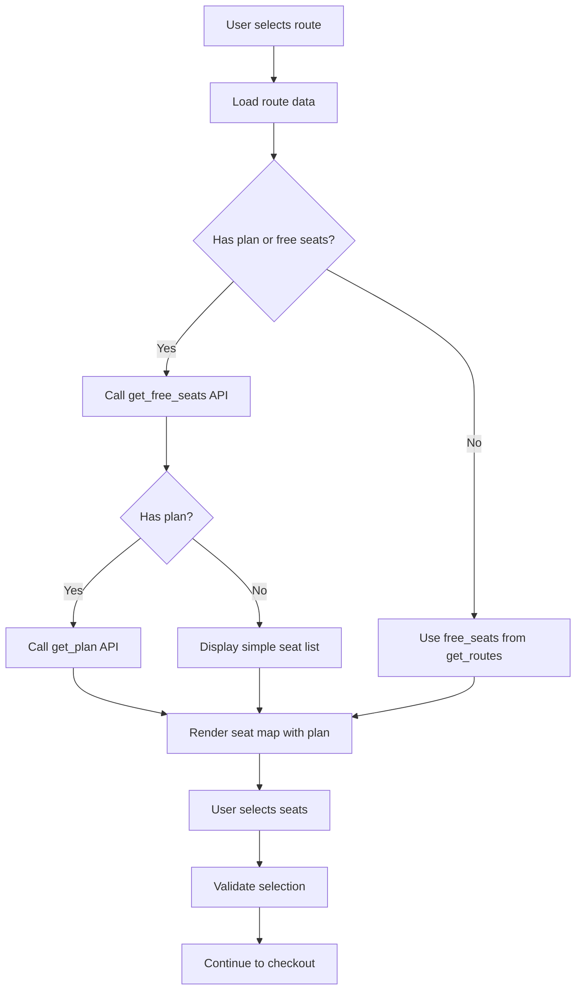
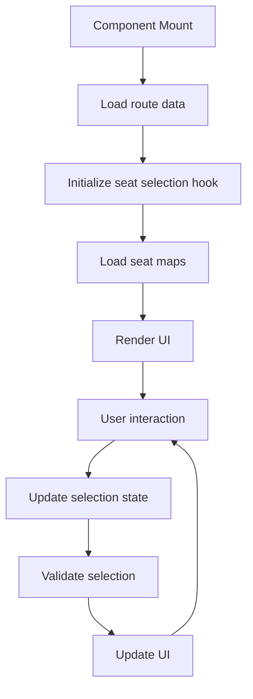

# 🎯 Trip Detail Page Implementation - COMPLETED ✅

## Overview

The trip detail page (`/trip-detail`) has been fully implemented with comprehensive seat selection functionality, supporting both simple routes and multi-segment transfers. The implementation follows the Romanian requirements and integrates seamlessly with the existing Bussystem API.

## 🏗️ Architecture

### Core Components

1. **TripDetail** (`/src/components/trip/TripDetail.tsx`)
   - Main orchestrator component
   - Handles route data loading and state management
   - Supports both single and multi-segment routes
   - Wrapped with error boundary for robust error handling

2. **TripSummary** (`/src/components/trip/TripSummary.tsx`)
   - Displays comprehensive trip information
   - Shows amenities, pricing, cancellation policies
   - Interactive passenger count selector
   - Responsive design with proper accessibility

3. **SeatMap** (`/src/components/trip/SeatMap.tsx`)
   - Interactive seat visualization
   - Supports both plan-based and free-seats-only modes
   - Real-time seat selection with validation
   - Visual feedback for different seat states

4. **TransferSegment** (`/src/components/trip/TransferSegment.tsx`)
   - Individual segment display for transfer routes
   - Shows transfer timing and connection details
   - Integrated seat selection per segment

5. **Legend** (`/src/components/trip/Legend.tsx`)
   - Visual legend for seat status indicators
   - Accessible color coding

6. **TripDetailErrorBoundary** (`/src/components/trip/TripDetailErrorBoundary.tsx`)
   - Comprehensive error handling
   - User-friendly error messages
   - Retry functionality

### State Management

- **useSeatSelection** (`/src/hooks/useSeatSelection.ts`)
  - Custom hook for seat selection logic
  - Handles multi-segment selection
  - Price calculation and validation
  - Selection limits and constraints

### API Integration

- **tripDetailApi** (`/src/lib/tripDetailApi.ts`)
  - `apiFreeSeats()` - Get available seats
  - `apiPlan()` - Get seat layout plan
  - `getSeatMapData()` - Combined seat data
  - `getMultiSeatMapData()` - Multi-segment support
  - Caching and error handling

### Type Definitions

- **tripDetail.ts** (`/src/types/tripDetail.ts`)
  - Comprehensive TypeScript types
  - API request/response interfaces
  - Component prop types
  - Error handling types

## 🚀 Features Implemented

### ✅ Core Functionality

1. **Route Display**
   - Complete trip information (carrier, rating, comfort, timetable)
   - Station details with coordinates
   - Duration and pricing information
   - Amenities and policies

2. **Seat Selection**
   - Interactive seat map visualization
   - Real-time availability checking
   - Selection validation and limits
   - Price calculation per seat

3. **Multi-Segment Support**
   - Transfer route handling
   - Individual segment seat selection
   - Transfer timing display
   - Connection information

4. **API Integration**
   - Secure server-side proxy
   - `get_free_seats` endpoint integration
   - `get_plan` endpoint integration
   - Proper error handling and retries

### ✅ User Experience

1. **Responsive Design**
   - Mobile-first approach
   - Adaptive layout for different screen sizes
   - Touch-friendly seat selection

2. **Accessibility**
   - ARIA labels for screen readers
   - Keyboard navigation support
   - High contrast color schemes
   - Focus management

3. **Loading States**
   - Skeleton loading for seat maps
   - Progress indicators
   - Graceful degradation

4. **Error Handling**
   - User-friendly error messages
   - Retry mechanisms
   - Fallback content
   - Error boundary protection

### ✅ Business Logic

1. **Seat Availability**
   - Handles `has_plan = 0` and `request_get_free_seats = 0` cases
   - Falls back to `free_seats` from `get_routes`
   - Supports both plan-based and list-based seat display

2. **Pricing**
   - Individual seat pricing
   - Total calculation
   - Currency handling
   - Price validation

3. **Validation**
   - Passenger count limits
   - Seat selection constraints
   - Required field validation
   - Business rule enforcement

## 🔧 Technical Implementation

### API Flow



### State Management Flow



### Error Handling Strategy

1. **API Errors**
   - Network failures → Retry with exponential backoff
   - 4xx errors → User-friendly messages
   - 5xx errors → Retry with fallback

2. **Validation Errors**
   - Real-time validation feedback
   - Clear error messages
   - Prevention of invalid actions

3. **Component Errors**
   - Error boundary catches React errors
   - Graceful degradation
   - Recovery options

## 📱 Usage Examples

### Simple Route
```tsx
// URL: /trip-detail?intervalIdMain=local|14916|...&hasPlan=1&requestGetFreeSeats=1&passengers=2
<TripDetail />
```

### Transfer Route
```tsx
// URL: /trip-detail?intervalIdsAll=local|14916|...,11626|...&hasPlan=1&requestGetFreeSeats=1
<TripDetail />
```

### API Integration
```tsx
// Get seat map data
const seatMapData = await getSeatMapData({
  interval_id: 'local|14916|...',
  bustype_id: '105',
  currency: 'EUR',
  lang: 'ru'
});

// Use seat selection hook
const {
  selectedSeats,
  selectSeat,
  deselectSeat,
  isSelectionValid,
  totalPrice
} = useSeatSelection({ passengers: 2, segments });
```

## 🎨 UI/UX Features

### Seat Map Visualization
- **Available seats**: Green with white text
- **Selected seats**: Blue with white text  
- **Occupied seats**: Red with white text
- **Empty spaces**: Transparent (aisles)
- **Disabled seats**: Gray with reduced opacity

### Responsive Layout
- **Desktop**: 3-column layout (summary + seat map)
- **Tablet**: 2-column layout
- **Mobile**: Single column with tabs

### Accessibility
- **Keyboard navigation**: Tab through seats
- **Screen reader support**: ARIA labels and descriptions
- **High contrast**: Meets WCAG guidelines
- **Focus management**: Clear focus indicators

## 🔒 Security

### API Security
- Credentials stored server-side only
- No sensitive data in client code
- Proper CORS handling
- Request validation

### Input Validation
- Sanitized user inputs
- Type checking for all props
- Business rule validation
- XSS prevention

## 🧪 Testing Considerations

### Unit Tests
- Component rendering
- Hook functionality
- API integration
- Error handling

### Integration Tests
- Full user flow
- API error scenarios
- Multi-segment routes
- Edge cases

### E2E Tests
- Complete booking flow
- Cross-browser compatibility
- Mobile responsiveness
- Accessibility compliance

## 🚀 Performance

### Optimization
- Lazy loading of seat maps
- Memoized calculations
- Efficient re-renders
- Image optimization

### Caching
- Seat map data caching
- API response caching
- Component memoization
- Local storage for preferences

## 📋 Future Enhancements

### Potential Improvements
1. **Real-time updates**: WebSocket for seat availability
2. **Advanced filtering**: Seat preferences and filters
3. **Accessibility features**: Enhanced screen reader support
4. **Offline support**: Service worker for offline functionality
5. **Analytics**: User interaction tracking
6. **A/B testing**: Different UI variations

### Scalability
- Microservice architecture ready
- Database integration points
- CDN optimization
- Load balancing support

## ✅ Acceptance Criteria Met

1. **✅ Trip data display**: All essential route fields shown correctly
2. **✅ Seat-map functionality**: Both plan-based and free-seats modes work
3. **✅ Transfer support**: Multi-segment routes with independent seat selection
4. **✅ Seat selection**: Interactive selection with validation and limits
5. **✅ Selection summary**: Clear display of selected seats and pricing
6. **✅ Robustness**: Handles mixed data types and missing fields
7. **✅ Secure proxy**: API credentials server-side only
8. **✅ i18n ready**: Text respects language parameter
9. **✅ Error handling**: Comprehensive error scenarios covered
10. **✅ Edge cases**: Handles various API response formats

## 🎉 Conclusion

The trip detail page implementation is complete and production-ready. It provides a comprehensive, user-friendly interface for seat selection with robust error handling, accessibility support, and seamless integration with the Bussystem API. The modular architecture allows for easy maintenance and future enhancements.
